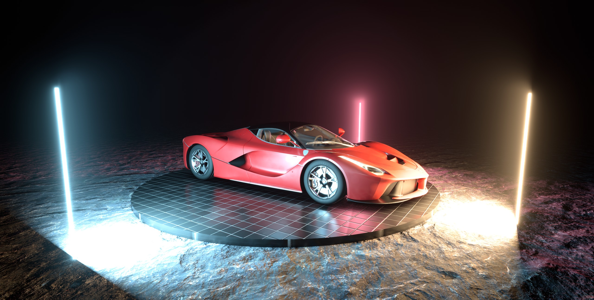
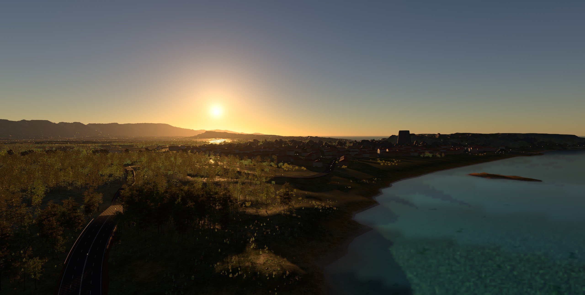
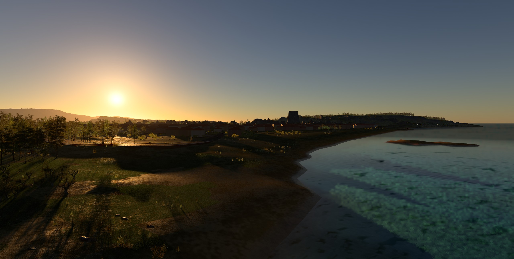
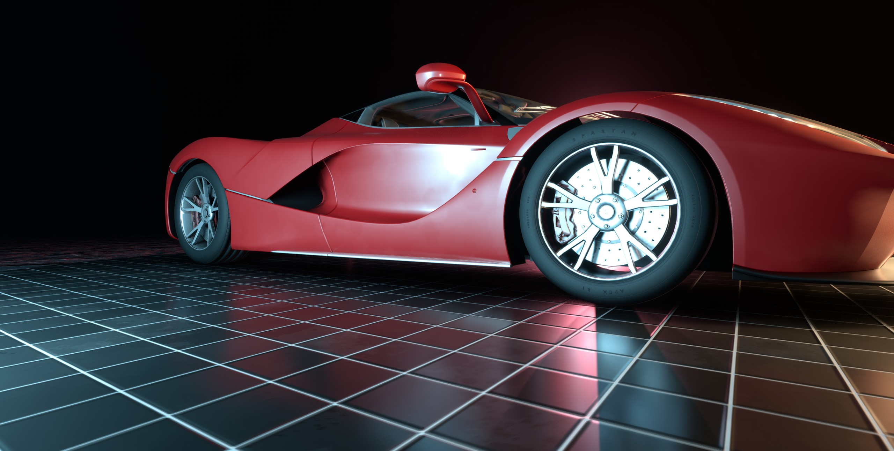
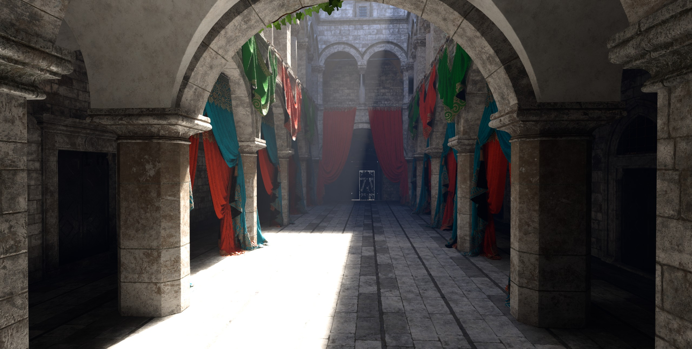
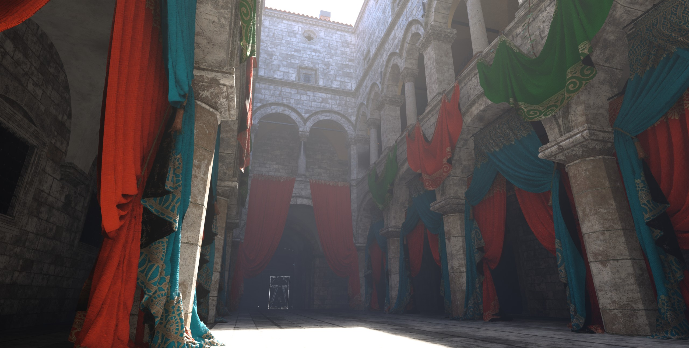
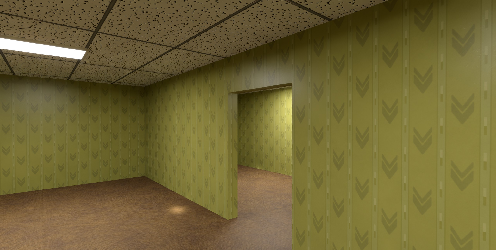

  

<h3 align="center">One engineer. Twelve years. Built from scratch.</h3>

  A bindless, GPU-driven C++ engine with real-time path-traced global illumination, hardware ray tracing and a 200 Hz vehicle simulation.

  
  
  

  <a href="https://panoskarabelas.com/">Website</a> &nbsp;&middot;&nbsp;
  <a href="https://discord.gg/TG5r2BS">Discord</a> &nbsp;&middot;&nbsp;
  <a href="https://x.com/panoskarabelas">X</a> &nbsp;&middot;&nbsp;
  <a href="https://github.com/PanosK92/SpartanEngine/wiki">Wiki</a>

  

---

## The Engine

Spartan is my personal engine, and it exists to power my own games. It started as a university project in 2014 and has been rebuilt, rethought and pushed forward almost every day since. Its rendering technology now runs in **Godot Engine** and **S.T.A.L.K.E.R. Anomaly**, it features in a **published programming book**, and more than **600 engineers** follow its development on Discord.

The source is open, but this is not a product and there is no hand-holding. No tutorials, no support queue, no compatibility promise: the code is the documentation. Spartan lives on the bleeding edge and moves fast, so it expects highly competent engineers with the agency to read the source, find their own answers and build something serious with it. If that is you, you will feel right at home.

**All of this tech is heading somewhere.** **[Read the plan →](https://github.com/PanosK92/SpartanEngine/blob/master/plan.md)**

  

---

## Rendered in Spartan

Every image below is a real-time capture from the engine, not an offline render.

<table>
  <tr>
    <td colspan="2"></td>
  </tr>
  <tr>
    <td colspan="2" align="center"><b>Zakynthos</b>: an open island some 30 km across, with towns, an airport, more than 200 spline roads, instanced forests and an FFT ocean</td>
  </tr>
  <tr>
    <td width="50%"></td>
    <td width="50%"></td>
  </tr>
  <tr>
    <td align="center"><b>Island coast</b>: dynamic time of day, atmospheric scattering and shallow-water caustics</td>
    <td align="center"><b>Showroom</b>: layered car paint with clearcoat and ray-traced reflections</td>
  </tr>
  <tr>
    <td width="50%"></td>
    <td width="50%"></td>
  </tr>
  <tr>
    <td align="center"><b>Sponza</b>: ReSTIR path tracing, no light probes, no bake</td>
    <td align="center"><b>Sponza</b>: multi-bounce light through cloth and stone</td>
  </tr>
  <tr>
    <td colspan="2"></td>
  </tr>
  <tr>
    <td colspan="2" align="center"><b>Liminal space</b>: procedural and streamed, lit by path-traced global illumination</td>
  </tr>
</table>

Launch the engine and pick a world. Nothing is a canned demo: every world is physics-enabled, so you can walk around, pick things up or take a car for a spin.

---

## Rendering

The renderer is built around one principle: **the GPU owns the data.** Geometry, materials, textures, lights, transforms and bounds live in persistent, globally accessible buffers. No per-draw descriptor updates, no per-draw resource binding, no CPU-side draw loops.

### Architecture

- **Zero-binding draw path**: all per-draw data lives in a single bindless storage buffer, push constants carry only an index
- **Single global vertex and index buffer** for all geometry (inspired by id Tech), with **vertex pulling** that bypasses the Input Assembler and is shared by rasterization and ray tracing
- **GPU-driven indirect rendering** with per-meshlet frustum, Hi-Z occlusion and backface cone culling; the CPU issues a single `DrawIndexedIndirectCount` per pass
- **Meshlet clustering** via meshoptimizer, with mesh shaders when available and a vertex-pulling fallback
- **Bindless everything**: materials, lights, samplers, uber shaders, minimal PSO permutations
- **Universal HLSL** compiled for both Vulkan (SPIR-V) and DirectX 12
- **GPU-side asset processing**: mip generation (FidelityFX SPD) and texture compression (Compressonator) at load time, not baked offline
- **Unified deferred rendering**: opaque and transparent surfaces share the same BSDF and render path
- **Async compute** for SSAO and screen-space shadows, in parallel with shadow rasterization

### Lighting and Global Illumination

- **ReSTIR path tracing** with spatiotemporal reservoir resampling for real-time multi-bounce global illumination
- **Clustered deferred shading** with a GPU-built logarithmic-Z grid and cone-vs-AABB culling for spots, so many local lights cost near-constant time per pixel
- **IES photometric light profiles** (LM-63): spot lights emit the measured beam of a real fixture, from car headlights with regulation cut-offs to architectural downlights, with correct lumens and candela across direct lighting, volumetric fog and path tracing. This is a feature usually reserved for the big commercial engines
- **Hardware ray-traced reflections and shadows** via ray queries
- **Atmospheric scattering** and image-based lighting with bent normals
- **Volumetric clouds** (Nubis-style) baked into the sky panorama, with cumulus and cirrus layers, multi-scatter lighting and aerial perspective
- **Froxel volumetric fog**: one view-aligned volume for height and distance fog, sun shafts and underwater caustic shafts, with temporal reprojection and shadowing
- **FFT ocean** with a Tessendorf spectrum and multi-cascade IFFT in compute, driving a camera-following clipmap with choppy displacement, dynamic normals and crest foam
- **Screen-space shadows** (inspired by Days Gone) and **XeGTAO** ambient occlusion
- **Shadow map atlas** with fast filtering and penumbra estimation

### Performance and Upscaling

- **NVIDIA DLSS 4.5** Super Resolution (SDK 310.9.1) and **Intel XeSS** 2.0.2 (SDK 3.0.2)
- **TAAU**: temporal anti-aliasing with built-in upsampling, Halton jitter and variance-clipped history
- **Variable rate shading** and **dynamic resolution scaling**
- **Foliage impostors** as the final GPU LOD, so dense forests stay cheap at distance
- **Texture streaming** within a fixed memory budget
- **Custom GPU breadcrumbs** for crash tracing and post-mortem debugging

### Camera and Post-Processing

- Physically based camera with auto-exposure and physical light units (lux, lumens and kelvin)
- Tonemappers: ACES, AgX and Gran Turismo 7 (default), with HDR10 output
- Bloom, motion blur, depth of field, chromatic aberration, film grain and sharpening (CAS)

---

## Car Simulation at 200 Hz

A full vehicle dynamics model running inside the PhysX fixed-timestep loop. Not a gameplay approximation: the kind of model you would expect from a dedicated racing sim, embedded in a general-purpose engine.

| System              | Details                                                                                            |
| ------------------- | -------------------------------------------------------------------------------------------------- |
| **Tires**           | Pacejka MF 5.2 with combined slip, thermal model, pressure, wear and multiple surfaces             |
| **Suspension**      | Convex hull sweep contact, spring-damper, anti-roll bars, bump stops, bump steer, camber and toe   |
| **Weight transfer** | Geometric and elastic lateral split via roll centre heights and roll stiffness                     |
| **Drivetrain**      | Engine torque curve, turbo, 7-speed gearbox, rev-match, open, locked and limited-slip differentials, RWD, FWD and AWD |
| **Brakes**          | Thermal model with fade, front/rear bias and slip-threshold ABS                                    |
| **Aerodynamics**    | Drag, front and rear downforce, ground effect, DRS and rolling resistance                          |
| **Steering**        | Ackermann geometry, high-speed reduction and self-aligning torque                                  |
| **Assists**         | ABS, traction control and handbrake                                                                |
| **Integration**     | Semi-implicit Euler with consolidated net torque per wheel                                         |
| **Input**           | Controllers and steering wheels with haptic feedback                                               |
| **Camera**          | GT7-inspired chase camera with speed-based dynamics                                                |

---

## Engine Systems

| System               | Details                                                                                           |
| -------------------- | ------------------------------------------------------------------------------------------------- |
| **Platforms**        | Windows (DirectX 12 and Vulkan) and Linux (Vulkan), with prebuilt binaries in every **[release](https://github.com/PanosK92/SpartanEngine/releases)** |
| **Physics**          | PhysX with rigid bodies, character kinematics and vehicle dynamics                                |
| **Animation**        | Skeletal animation with keyframed clips, crossfade blending, four-bone skinning and two-bone IK with ground-aware foot planting |
| **Particles**        | GPU-driven compute emission and simulation, depth-buffer collision and soft blending              |
| **Weather**          | Rain that soaks exposed surfaces, fills puddles and keeps covered areas dry, feeding tire grip    |
| **Procedural roads** | Catmull-Rom spline roads with extruded profiles, terrain conforming, instanced props and path followers |
| **Scripting**        | Lua 5.4 via Sol2 with the full engine API and lifecycle callbacks                                 |
| **Audio**            | 3D positional audio, streaming, reverb and procedural engine synthesis via SDL3                   |
| **Cinematics**       | Camera cut sequencer with entity tracking, spline-driven movement and exact cut timing            |
| **Entity system**    | Component-based with transform hierarchies, prefabs and XML serialization                         |
| **Threading**        | Hardware-aware thread pool with parallel loops and nested parallelism detection                   |
| **Editor**           | Hierarchy, asset browser, inspector, script and shader editors, gizmos, profiler and memory viewer |
| **Profiling**        | Nsight/RGP-style timeline with graphics and async compute lanes, RenderDoc integration and a GPU/CPU memory fragmentation map |
| **AI control**       | An MCP bridge lets AI agents drive the live engine: build scenes, tune materials, drive cars and review screenshots |
| **Asset import**     | 40+ model formats (Assimp), 30+ image formats (FreeImage), 10+ font formats (FreeType)            |
| **VR (WIP)**         | OpenXR with multiview single-pass stereo on Vulkan and DirectX 12                                 |

---

## Getting Started

**Build.** Project generation is one click; the **[Building Guide](https://github.com/PanosK92/SpartanEngine/wiki/Building)** has the details. On Linux, run `tools/linux_dependencies.sh` once, then `./generate_project_files.sh gmake vulkan` and `make config=release_x64`. Worlds live in `worlds/` as XML. Their assets (models, materials, audio, scripts) live in `binaries/project/`, which is excluded from Git and downloaded during setup.

**Learn.** Start with **[Engine.cpp](https://github.com/PanosK92/SpartanEngine/blob/master/source/core/Engine.cpp)**, the engine entry point and the clearest view of the startup path. For gameplay code, the **[Lua Scripting Guide](https://github.com/PanosK92/SpartanEngine/wiki/Scripting)** covers the API, lifecycle callbacks and examples.

---

## Community

**Discord.** Rendering deep dives, work in progress and a shared obsession with how things work. **[Join 600+ engineers →](https://discord.gg/TG5r2BS)**

**Contributing.** Contributors get **[exclusive perks](https://github.com/PanosK92/SpartanEngine/wiki/Perks-of-a-contributor)** designed to accelerate learning. **[Read the Contributing Guide →](https://github.com/PanosK92/SpartanEngine/wiki/Contributing)**

**Sponsorship.** I cover the hosting that makes the one-click setup work. If Spartan has taught you something, **[sponsorship](https://github.com/sponsors/PanosK92)** keeps the lights on and the project moving.

**Podcast.** *Exploring the tech world and beyond*, conversations with the brightest minds across cutting-edge industries. **[YouTube](https://youtu.be/OZRwCZhglsQ)** &middot; **[Spotify](https://open.spotify.com/show/5F27nWKn9TZdClc5db9efY)**

---

## Spartan in the Wild

| Project                    | Description                                                                                                                                                                                                                      |
| -------------------------- | -------------------------------------------------------------------------------------------------------------------------------------------------------------------------------------------------------------------------------- |
| **Godot Engine**           | Integrates Spartan's TAA ([view source](https://github.com/godotengine/godot/blob/37d51d2cb7f6e47bef8329887e9e1740a914dc4e/servers/rendering/renderer_rd/shaders/effects/taa_resolve.glsl#L2))                                   |
| **S.T.A.L.K.E.R. Anomaly** | Rendering addon using Spartan's source ([ModDB](https://www.moddb.com/mods/stalker-anomaly/addons/screen-space-shaders))                                                                                                         |
| **Programming Book**       | Jesse Guerrero's [beginner programming book](https://www.amazon.com/dp/B0CXG1CMNK) features Spartan's code and community                                                                                                         |
| **University Thesis**      | Originally created as a portfolio piece while studying at the [University of Thessaly](https://en.wikipedia.org/wiki/University_of_Thessaly) with Professor [Fotis Kokkoras](https://ds.uth.gr/en/staff-en/faculty-en/kokkoras/) |

**Using code from Spartan?** [Reach out](https://x.com/panoskarabelas), I'd love to showcase your project.

---

## License

**[Spartan Engine License 1.0](license.md)** permits free noncommercial use,
modification, and redistribution, including reuse of covered code in other projects.
Keep the copyright notice identifying **Panos Karabelas** and the license with
redistributed code; compiled distributions must carry them in documentation or
accessible legal notices.

**Commercial use requires prior written permission and negotiated payment terms.**
Fees, royalties, or a combination are agreed case by case, with no automatic rate
or revenue threshold. This applies to the engine and covered code copied into
other games, engines, libraries, tools, or applications. Contact
[Panos Karabelas](https://panoskarabelas.com/) to discuss your project.

Third-party components retain their own licenses. Copies and versions previously
released under MIT retain their existing permissions. See [license.md](license.md)
for the complete terms.
