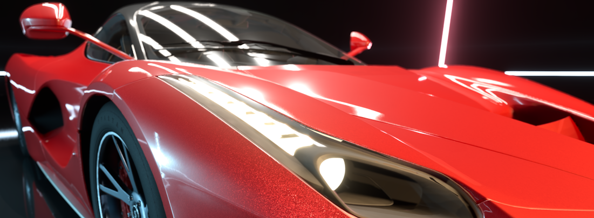
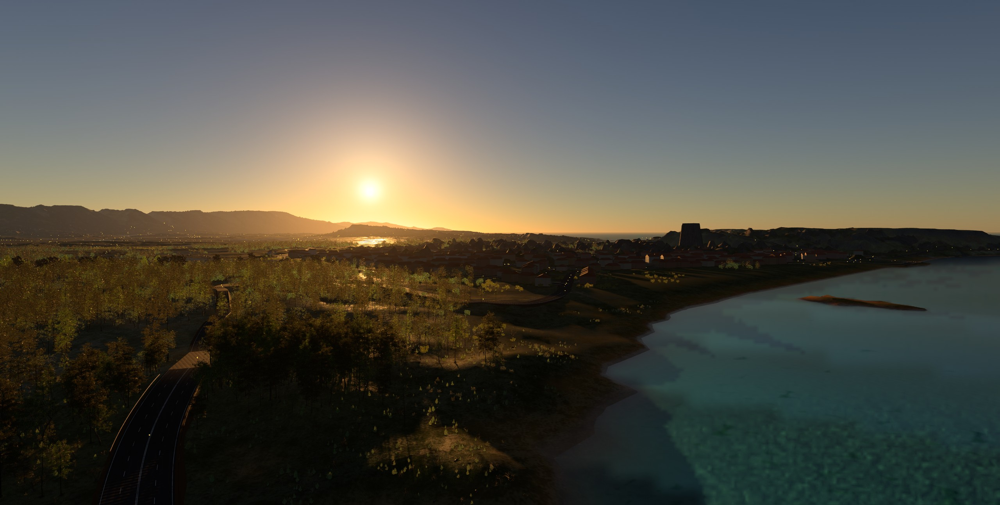
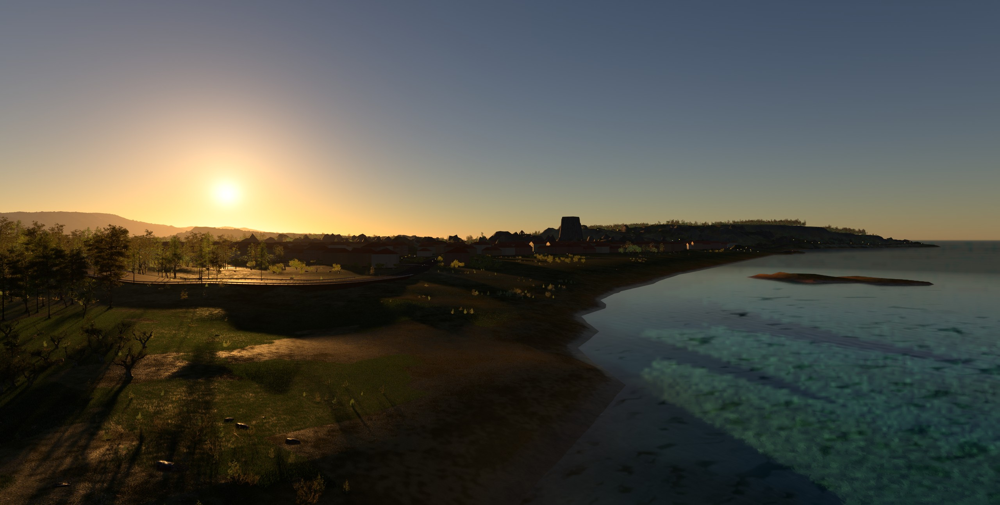
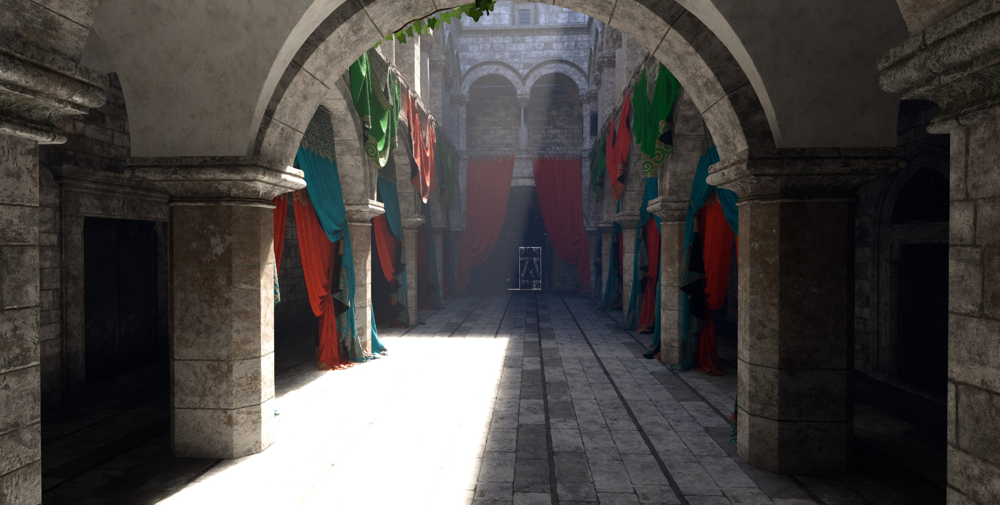
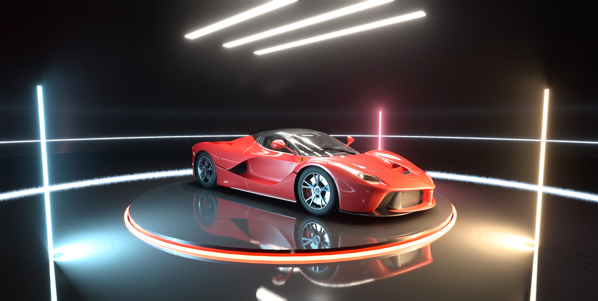
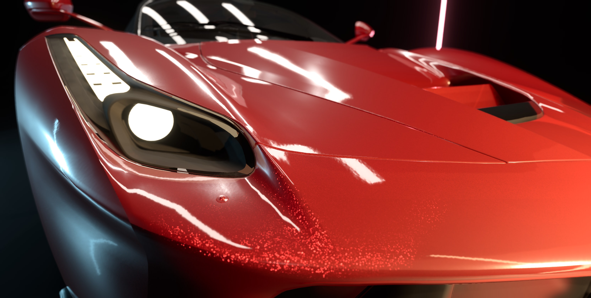
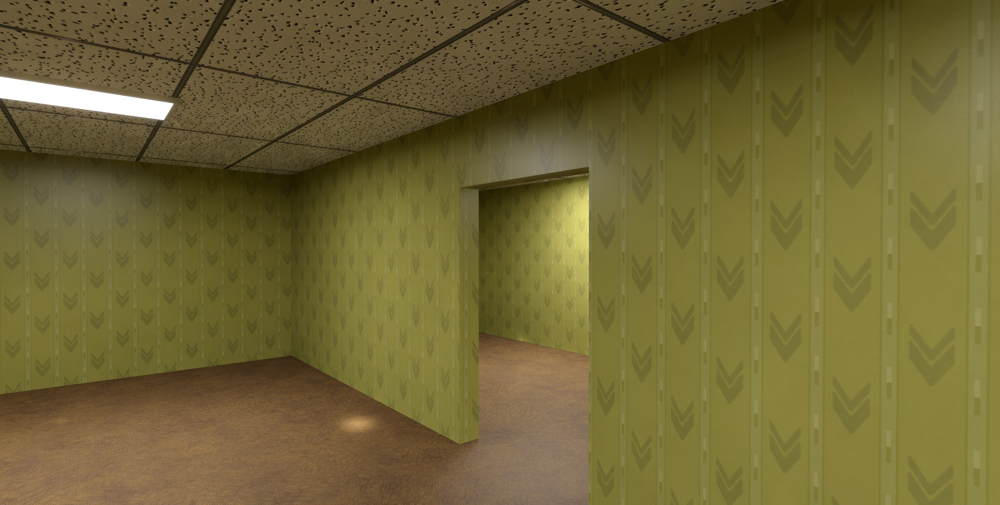
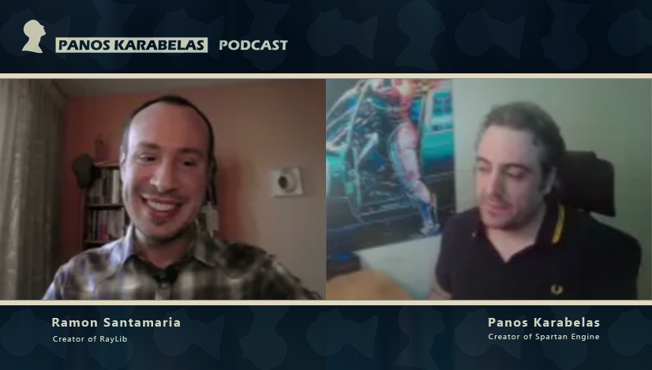

<p align="center">
  
</p>

<h3 align="center">Path traced. GPU driven.</h3>
<p align="center"><i>Started before AI and developed alongside me while in the game industry.</i></p>

<p align="center">
  <a href="https://github.com/PanosK92/SpartanEngine/actions"></a>
  <a href="https://discord.gg/TG5r2BS"></a>
  <a href="https://github.com/PanosK92/SpartanEngine/stargazers"></a>
  <a href="https://github.com/PanosK92/SpartanEngine/blob/master/license.md"></a>
</p>

<p align="center">
  <a href="https://github.com/PanosK92/SpartanEngine/releases"></a>&nbsp;
  <a href="https://github.com/PanosK92/SpartanEngine/blob/master/plan.md"></a>&nbsp;
  <a href="https://github.com/PanosK92/SpartanEngine/wiki"></a>&nbsp;
  <a href="https://discord.gg/TG5r2BS"></a>&nbsp;
  <a href="https://x.com/panoskarabelas"></a>&nbsp;
  <a href="https://panoskarabelas.com/"></a>
</p>

<br/>

<table align="center">
  <tr>
    <td align="center" width="160"><h2>12</h2><sub>YEARS IN DEVELOPMENT</sub></td>
    <td align="center" width="160"><h2>1</h2><sub>ENGINEER</sub></td>
    <td align="center" width="160"><h2>600+</h2><sub>ENGINEERS ON DISCORD</sub></td>
    <td align="center" width="160"><h2>200 Hz</h2><sub>VEHICLE SIMULATION</sub></td>
  </tr>
</table>

<table align="center">
  <tr>
    <td align="center" colspan="3"><sub><b>PLATFORMS</b></sub></td>
    <td align="center" colspan="3"><sub><b>GRAPHICS APIS</b></sub></td>
  </tr>
  <tr>
    <td align="center" width="105"><br/><sub>Windows</sub></td>
    <td align="center" width="105"><br/><sub>Linux</sub></td>
    <td align="center" width="105"><br/><sub>macOS</sub></td>
    <td align="center" width="105"><br/><sub>DirectX 12</sub></td>
    <td align="center" width="105"><br/><sub>Vulkan</sub></td>
    <td align="center" width="105"><br/><sub>Metal</sub></td>
  </tr>
</table>

<br/>

## Overview

Spartan is a **complete C++ game engine**. Path-traced global illumination, hardware ray tracing, a bindless GPU-driven renderer and a racing-grade vehicle simulation sit alongside what a shipped game needs:

<table>
  <tr>
    <td align="center" width="20%" valign="top"><b>Editor</b></td>
    <td align="center" width="20%" valign="top"><b>Lua scripting</b><br/><sub>for gameplay</sub></td>
    <td align="center" width="20%" valign="top"><b>Standalone runtime</b></td>
    <td align="center" width="20%" valign="top"><b>Game builder</b><br/><sub>packages a world into a distributable game</sub></td>
    <td align="center" width="20%" valign="top"><b>Steam</b><br/><sub>achievements, stats and rich presence</sub></td>
  </tr>
</table>

The bundled worlds show the range, from **Plan**, a playable racing game across the island of Zakynthos, to path-traced interiors and a car showroom. Its rendering technology ships in **Godot Engine** and **S.T.A.L.K.E.R. Anomaly**, it features in a **published programming book**, and more than **600 engineers** follow its development on Discord.

> [!IMPORTANT]
> **Built for veterans.** Spartan is one engineer's engine, so there is no support queue and no one-to-one help. There is a [wiki](https://github.com/PanosK92/SpartanEngine/wiki), a [Lua scripting guide](https://github.com/PanosK92/SpartanEngine/wiki/Scripting) and a codebase written to be read. If you are a high-agency engineer who can take it from there, you can ship with it.

## Showcase

<table>
  <tr>
    <td colspan="2"></td>
  </tr>
  <tr>
    <td colspan="2" align="center"><sub><b>ZAKYNTHOS</b> &nbsp;·&nbsp; an island some 30 km across with towns, an airport, 200+ spline roads, instanced forests and an FFT ocean</sub></td>
  </tr>
  <tr>
    <td width="50%"></td>
    <td width="50%"></td>
  </tr>
  <tr>
    <td align="center"><sub><b>ISLAND COAST</b> &nbsp;·&nbsp; dynamic time of day, atmospheric scattering, shallow-water caustics</sub></td>
    <td align="center"><sub><b>SPONZA</b> &nbsp;·&nbsp; ReSTIR path tracing, no light probes, no bake</sub></td>
  </tr>
  <tr>
    <td></td>
    <td></td>
  </tr>
  <tr>
    <td align="center"><sub><b>SHOWROOM</b> &nbsp;·&nbsp; LaFerrari lit by three emissive tubes through volumetric fog</sub></td>
    <td align="center"><sub><b>CAR PAINT</b> &nbsp;·&nbsp; layered clearcoat and ray-traced reflections</sub></td>
  </tr>
  <tr>
    <td colspan="2"></td>
  </tr>
  <tr>
    <td colspan="2" align="center"><sub><b>LIMINAL OFFICE</b> &nbsp;·&nbsp; procedural and streamed, path traced, no bake</sub></td>
  </tr>
</table>

<p align="center"><sub>All real-time captures. Every world is fully simulated: walkable, interactive and drivable.</sub></p>

## Features

<table>
  <tr>
    <td width="33%" valign="top" align="center"><h3>No bake</h3><sub>ReSTIR path-traced global illumination every frame. No probes, no lightmaps.</sub></td>
    <td width="33%" valign="top" align="center"><h3>One draw per pass</h3><sub>The GPU owns the data. Bindless buffers, GPU culling, a single indirect draw.</sub></td>
    <td width="33%" valign="top" align="center"><h3>200 Hz</h3><sub>Racing-sim vehicle dynamics inside a general-purpose engine.</sub></td>
  </tr>
</table>

<p align="center"><sub>Expand a section for the full breakdown.</sub></p>

<details>
<summary><b>Lighting and global illumination</b> &nbsp;·&nbsp; <sub>ReSTIR, ray tracing, IES profiles, clouds, fog, FFT ocean</sub></summary>

<br/>

- **ReSTIR path tracing** with spatiotemporal reservoir resampling for real-time multi-bounce global illumination
- **Clustered deferred shading** with a GPU-built logarithmic-Z grid and cone-vs-AABB culling for spots, so many local lights cost near-constant time per pixel
- **IES photometric light profiles** (LM-63): spot lights emit the measured beam of a real fixture, from car headlights with regulation cut-offs to architectural downlights, with correct lumens and candela across direct lighting, volumetric fog and path tracing. A feature usually reserved for the big commercial engines
- **Hardware ray-traced reflections and shadows** via ray queries
- **Atmospheric scattering** and image-based lighting with bent normals
- **Volumetric clouds** (Nubis-style) baked into the sky panorama, with cumulus and cirrus layers, multi-scatter lighting and aerial perspective
- **Froxel volumetric fog**: one view-aligned volume for height and distance fog, sun shafts and underwater caustic shafts, with temporal reprojection and shadowing
- **FFT ocean** with a Tessendorf spectrum and multi-cascade IFFT in compute, driving a camera-following clipmap with choppy displacement, dynamic normals and crest foam
- **Screen-space shadows** (inspired by Days Gone) and **XeGTAO** ambient occlusion
- **Shadow map atlas** with fast filtering and penumbra estimation

</details>

<details>
<summary><b>Rendering architecture</b> &nbsp;·&nbsp; <sub>bindless, GPU-driven, meshlets, universal HLSL</sub></summary>

<br/>

Geometry, materials, textures, lights, transforms and bounds live in persistent, globally accessible buffers. No per-draw descriptor updates, no per-draw resource binding, no CPU-side draw loops.

- **Zero-binding draw path**: all per-draw data lives in a single bindless storage buffer, push constants carry only an index
- **Single global vertex and index buffer** for all geometry (inspired by id Tech), with **vertex pulling** that bypasses the Input Assembler and is shared by rasterization and ray tracing
- **GPU-driven indirect rendering** with per-meshlet frustum, Hi-Z occlusion and backface cone culling; the CPU issues a single `DrawIndexedIndirectCount` per pass
- **Meshlet clustering** via meshoptimizer, with mesh shaders when available and a vertex-pulling fallback
- **Bindless everything**: materials, lights, samplers, uber shaders, minimal PSO permutations
- **Universal HLSL** compiled for Vulkan (SPIR-V), DirectX 12 and Metal (Metal Shader Converter)
- **GPU-side asset processing**: mip generation (FidelityFX SPD) and texture compression (Compressonator) at load time, not baked offline
- **Unified deferred rendering**: opaque and transparent surfaces share the same BSDF and render path
- **Async compute** for SSAO and screen-space shadows, in parallel with shadow rasterization

</details>

<details>
<summary><b>Performance, camera and post-processing</b> &nbsp;·&nbsp; <sub>DLSS 4.5, XeSS, FSR 4 upscaling, FSR 3.1 frame generation, TAAU, VRS, GT7 tonemapping, HDR10</sub></summary>

<br/>

- **NVIDIA DLSS 4.5** Super Resolution (SDK 310.9.1) and **Intel XeSS** 2.0.2 (SDK 3.0.2)
- **AMD FSR upscaling** (FSR SDK 2.4.0) on Windows with Vulkan and D3D12. Select AMD FSR in Renderer Options (or `r.antialiasing_upsampling 5`). The SDK selects FSR 4.1.2 on supported Radeon GPUs and FSR 3.1 on other supported GPUs. Run dependency setup to fetch the signed loader and upscaler DLLs. Frame generation retains its existing, separate SDK.
- **AMD FSR 3.1 frame generation** (FidelityFX SDK 1.1.4) on Vulkan and D3D12, works on any vendor's GPU, with frame-generation-aware fps, latency and frame rate limiting
- **TAAU**: temporal anti-aliasing with built-in upsampling, Halton jitter and variance-clipped history
- **Variable rate shading** and **dynamic resolution scaling**
- **Foliage impostors** as the final GPU LOD, so dense forests stay cheap at distance
- **Texture streaming** within a fixed memory budget
- **Custom GPU breadcrumbs** for crash tracing and post-mortem debugging
- **Physically based camera** with auto-exposure and physical light units (lux, lumens and kelvin)
- **Tonemappers**: ACES, AgX and Gran Turismo 7 (default), with HDR10 output
- **Post-processing**: bloom, motion blur, depth of field, chromatic aberration, film grain and sharpening (CAS)

</details>

<details>
<summary><b>Vehicle dynamics at 200 Hz</b> &nbsp;·&nbsp; <sub>Pacejka tires, thermal brakes, LSD, aero, force feedback</sub></summary>

<br/>

A full vehicle dynamics model running inside the PhysX fixed-timestep loop. Not a gameplay approximation: racing-sim fidelity inside a general-purpose engine.

| System              | Details                                                                                            |
| ------------------- | -------------------------------------------------------------------------------------------------- |
| **Tires**           | Pacejka MF 5.2 with combined slip, thermal model, pressure, wear and multiple surfaces             |
| **Suspension**      | Convex hull sweep contact, spring-damper, anti-roll bars, bump stops, bump steer, camber and toe   |
| **Weight transfer** | Geometric and elastic lateral split via roll centre heights and roll stiffness                     |
| **Drivetrain**      | Engine torque curve, turbo, 7-speed gearbox, rev-match, open, locked and limited-slip differentials, RWD, FWD and AWD |
| **Brakes**          | Thermal model with fade, front/rear bias and slip-threshold ABS                                    |
| **Aerodynamics**    | Drag, front and rear downforce, ground effect, DRS and rolling resistance                          |
| **Steering**        | Ackermann geometry, high-speed reduction and self-aligning torque                                  |
| **Assists**         | ABS, traction control and handbrake                                                                |
| **Integration**     | Semi-implicit Euler with consolidated net torque per wheel                                         |
| **Input**           | Controllers and steering wheels with haptic feedback                                               |
| **Camera**          | GT7-inspired chase camera with speed-based dynamics                                                |

</details>

<details>
<summary><b>Engine systems</b> &nbsp;·&nbsp; <sub>physics, animation, particles, weather, roads, Lua, audio, editor, profiler, VR</sub></summary>

<br/>

| System               | Details                                                                                           |
| -------------------- | ------------------------------------------------------------------------------------------------- |
| **Platforms**        | Windows (DirectX 12 and Vulkan), Linux (Vulkan) and macOS 26.0+ (Metal 4), with prebuilt binaries in every **[release](https://github.com/PanosK92/SpartanEngine/releases)** |
| **Physics**          | PhysX with rigid bodies, character kinematics and vehicle dynamics                                |
| **Animation**        | Skeletal animation with keyframed clips, crossfade blending, four-bone skinning and two-bone IK with ground-aware foot planting |
| **Particles**        | GPU-driven compute emission and simulation, depth-buffer collision and soft blending              |
| **Weather**          | Rain that soaks exposed surfaces, fills puddles and keeps covered areas dry, feeding tire grip    |
| **Procedural roads** | Catmull-Rom spline roads with extruded profiles, terrain conforming, instanced props and path followers |
| **Scripting**        | Lua 5.4 via Sol2 with the full engine API and lifecycle callbacks                                 |
| **Audio**            | 3D positional audio, streaming, reverb and procedural engine synthesis via SDL3                   |
| **Cinematics**       | Camera cut sequencer with entity tracking, spline-driven movement and exact cut timing            |
| **Entity system**    | Component-based with transform hierarchies, prefabs and XML serialization                         |
| **Threading**        | Hardware-aware thread pool with parallel loops and nested parallelism detection                   |
| **Editor**           | Hierarchy, asset browser, inspector, script and shader editors, gizmos, profiler and memory viewer |
| **Profiling**        | Nsight/RGP-style timeline with graphics and async compute lanes, RenderDoc integration and a GPU/CPU memory fragmentation map |
| **Asset import**     | 40+ model formats (Assimp), 30+ image formats (FreeImage), 10+ font formats (FreeType)            |
| **VR (WIP)**         | OpenXR with multiview single-pass stereo on Vulkan and DirectX 12                                 |

</details>

## Quick start

> [!TIP]
> **Just want to try it?** Prebuilt binaries ship with every **[release](https://github.com/PanosK92/SpartanEngine/releases)**. Building from source? The **[Building Guide](https://github.com/PanosK92/SpartanEngine/wiki/Building)** has the details.

#### &nbsp; Windows

```powershell
# then open spartan.slnx (use d3d12 for DirectX 12, or no arguments for a menu)
generate_project_files.bat vs2026 vulkan
```

#### &nbsp; Linux

```bash
tools/linux_dependencies.sh && ./generate_project_files.sh gmake vulkan && make config=release_x64
```

#### &nbsp; macOS 26.0+ &nbsp;<sub>Apple silicon, Metal 4</sub>

```bash
# needs Xcode 26, Homebrew (brew install cmake ninja) and the Metal Shader Converter
# from developer.apple.com/metal/shader-converter, then open spartan.xcworkspace
tools/macos_dependencies.sh && ./generate_project_files.sh xcode4 metal
```

<table>
  <tr>
    <td width="33%" valign="top"><b>Worlds</b><br/><sub>Live in <code>worlds/</code> as XML. Their assets live in <code>binaries/project/</code>, excluded from Git and downloaded during setup.</sub></td>
    <td width="33%" valign="top"><b>Start reading</b><br/><sub><b><a href="https://github.com/PanosK92/SpartanEngine/blob/master/source/core/Engine.cpp">Engine.cpp</a></b>, the entry point.</sub></td>
    <td width="33%" valign="top"><b>Gameplay code</b><br/><sub>The <b><a href="https://github.com/PanosK92/SpartanEngine/wiki/Scripting">Lua Scripting Guide</a></b>.</sub></td>
  </tr>
</table>

<details>
<summary><b>Build targets and architecture notes</b></summary>

The `binaries/` folder keeps executables at the top level. Windows vendor DLLs live in `third_party/` (Direct3D Agility components in `third_party/d3d12/`), compiler intermediates and Windows symbols in `build/`, preferences in `settings/`, diagnostics in `logs/`, and engine-wide generated data in `cache/`. Existing preferences, logs, and engine caches migrate on first launch without replacing files already at the new locations. World-specific bake caches remain alongside their world resources. `data/`, `project/`, and `crashes/` retain their existing roles. `steam_appid.txt` stays beside the executable for local Steam development. Ship the vendor folder with the executable; game exports and Windows release archives preserve its structure. Python bytecode caches are excluded from game exports.


<br/>

Project generation creates these targets, all using the selected graphics backend:

| Target               | What it is                                                           | Executable                                   |
| -------------------- | -------------------------------------------------------------------- | -------------------------------------------- |
| **`Spartan`**        | The editor                                                           | `spartan_<backend>_development.exe`          |
| **`SpartanRuntime`** | The game and HUD, without editor widgets                             | `spartan_<backend>_runtime_development.exe`  |

The runtime targets take an existing world with `--world <absolute-world-path>` and start play once it is prepared. Resource paths remain relative to the executable, as in the editor. The editor's `-game` option hides its panels.

With dependencies already installed, regenerate without downloading them:

```powershell
tools/premake5.exe --file=tools/premake.lua --skip-setup vs2026 vulkan
```

```bash
# macOS
tools/premake5 --file=tools/premake.lua --skip-setup xcode4 metal
```

**Engine and world boundary.** There is no game layer in C++. `source/world/WorldSystems.cpp` installs the world lifecycle hooks: camera controls, vehicle render submissions, breakable trees and the optional world systems (ambient wildlife, ambient atmosphere, road details, layered road surfaces). Vehicle physics and state live under `source/car`, vehicle MCP commands in `source/mcp/McpCommandsCar.cpp`, and traffic, race drivers, route drivers, car resets and skid marks are regular components in `source/world/components`. The optional world systems are off by default; a world turns them on through the `WorldSystems` Lua table from its companion script, the `.lua` with the same name next to the `.world` (`worlds/plan.lua` for `plan.world`), which runs on every load before the roads are built. Worker model imports publish their entity hierarchy through `World::EntityBatch::Commit()` after construction succeeds.

**Physics.** Scene stepping and contact observation use game-independent callbacks; the game installs vehicle contact handling. Vehicle state is opaque to engine consumers, while the existing `Physics` authoring and Lua API remains compatible.

**Asset ownership.** World saves record native asset ownership in `OwnedResources`. Automatic cleanup only removes unreferenced files recorded there; unlisted files, shared libraries, sculpt data and generated caches keep their separate lifetimes. Legacy worlds acquire ownership of referenced assets when saved and do not prune unrelated legacy files.

**Component attributes.** Attributes exposed for editing go through the component's setters. Raw copy-only or derived fields are read-only; use the named authoring properties for edits.

**Play lifecycle.** Play startup captures all authored transforms before any component starts, with both phases spread across frames. Stopping play drains completed worker batches before restoration and removal. World unload cancels staged work and clears renderer scene references and temporal history while preserving device lookup tables.

</details>

## In the wild

<table>
  <tr>
    <td width="25%" valign="top"><b>Godot Engine</b><br/><sub>Integrates Spartan's TAA</sub><br/><sub><a href="https://github.com/godotengine/godot/blob/37d51d2cb7f6e47bef8329887e9e1740a914dc4e/servers/rendering/renderer_rd/shaders/effects/taa_resolve.glsl#L2">Source →</a></sub></td>
    <td width="25%" valign="top"><b>S.T.A.L.K.E.R. Anomaly</b><br/><sub>Ships a rendering addon built on Spartan's source</sub><br/><sub><a href="https://www.moddb.com/mods/stalker-anomaly/addons/screen-space-shaders">ModDB →</a></sub></td>
    <td width="25%" valign="top"><b>Published book</b><br/><sub>Jesse Guerrero's beginner programming book features Spartan's code and community</sub><br/><sub><a href="https://www.amazon.com/dp/B0CXG1CMNK">Amazon →</a></sub></td>
    <td width="25%" valign="top"><b>Origin</b><br/><sub>A portfolio piece at the <a href="https://en.wikipedia.org/wiki/University_of_Thessaly">University of Thessaly</a> under Professor <a href="https://ds.uth.gr/en/staff-en/faculty-en/kokkoras/">Fotis Kokkoras</a></sub></td>
  </tr>
</table>

<p align="center"><sub>Projects built on Spartan code can be featured here. <b><a href="https://x.com/panoskarabelas">Get in touch →</a></b></sub></p>

## Ready for games?

> **Yes.** Older coverage, like *"The BEST Game Engine You SHOULDN'T Use"*, describes an engine that no longer exists. Back then Spartan was a renderer. Today it has the scripting, runtime, packaging and Steam support to ship, and graphically it goes further than any other open-source engine.
>
> The one thing that hasn't changed is support: if you need hand-holding, pick something else. If you don't, **Spartan is ready.**

## Community

<table>
  <tr>
    <td width="50%" valign="top">
      <b><a href="https://discord.gg/TG5r2BS">Discord</a></b><br/>
      <sub>Rendering deep dives and work in progress, with 600+ engineers.</sub>
      <br/><br/>
      <b><a href="https://github.com/PanosK92/SpartanEngine/wiki/Contributing">Contribute</a></b><br/>
      <sub>Contributors get <a href="https://github.com/PanosK92/SpartanEngine/wiki/Perks-of-a-contributor">exclusive perks</a> designed to accelerate learning.</sub>
      <br/><br/>
      <b><a href="https://github.com/sponsors/PanosK92">Sponsor</a></b><br/>
      <sub>Funds the hosting behind the one-click setup.</sub>
    </td>
    <td width="50%" valign="top">
      <a href="https://youtu.be/OZRwCZhglsQ"></a><br/>
      <b>Podcast</b> &nbsp;·&nbsp; <sub><i>Exploring the tech world and beyond</i>, conversations across cutting-edge industries, on <a href="https://youtu.be/OZRwCZhglsQ">YouTube</a> and <a href="https://open.spotify.com/show/5F27nWKn9TZdClc5db9efY">Spotify</a></sub>
    </td>
  </tr>
</table>

## License

> [!NOTE]
> Free for noncommercial use under the **[Spartan Engine License 1.0](license.md)**. **Commercial use requires prior written permission and negotiated payment terms.**

<details>
<summary>License summary</summary>

<br/>

The license permits free noncommercial use, modification, and redistribution, including reuse of covered code in other projects. Keep the copyright notice identifying **Panos Karabelas** and the license with redistributed code; compiled distributions must carry them in documentation or accessible legal notices.

Commercial fees, royalties, or a combination are agreed case by case, with no automatic rate or revenue threshold. This applies to the engine and covered code copied into other games, engines, libraries, tools, or applications. Contact [Panos Karabelas](https://panoskarabelas.com/) to discuss your project.

Third-party components retain their own licenses. Copies and versions previously released under MIT retain their existing permissions. See [license.md](license.md) for the complete terms.

</details>

<br/>

<p align="center"><sub>Built by <a href="https://panoskarabelas.com/">Panos Karabelas</a> &nbsp;·&nbsp; 12 years and counting</sub></p>
